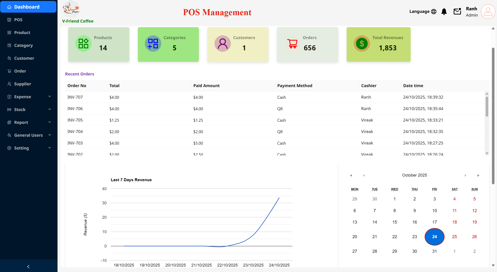
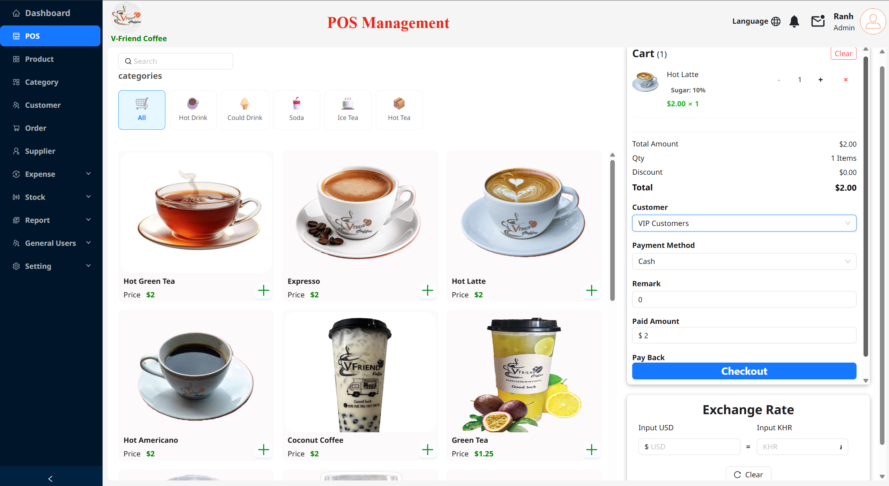
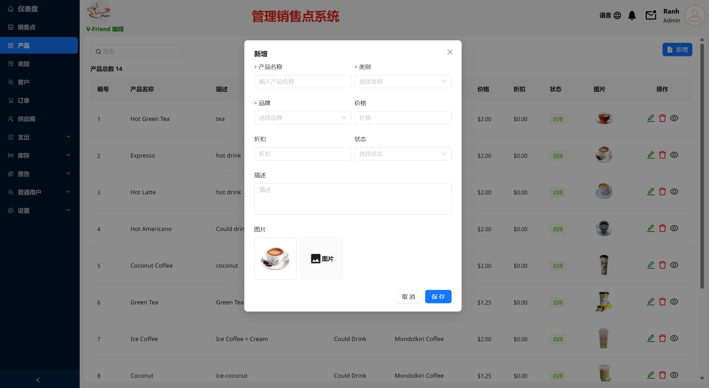
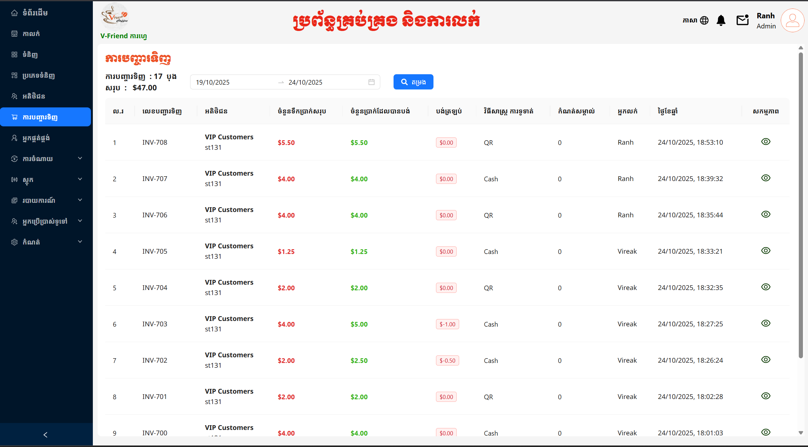
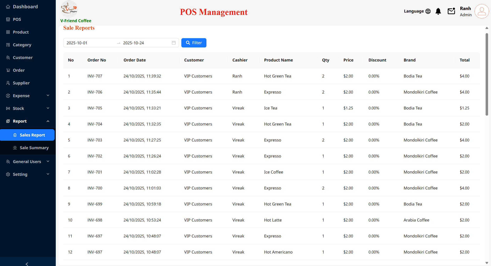
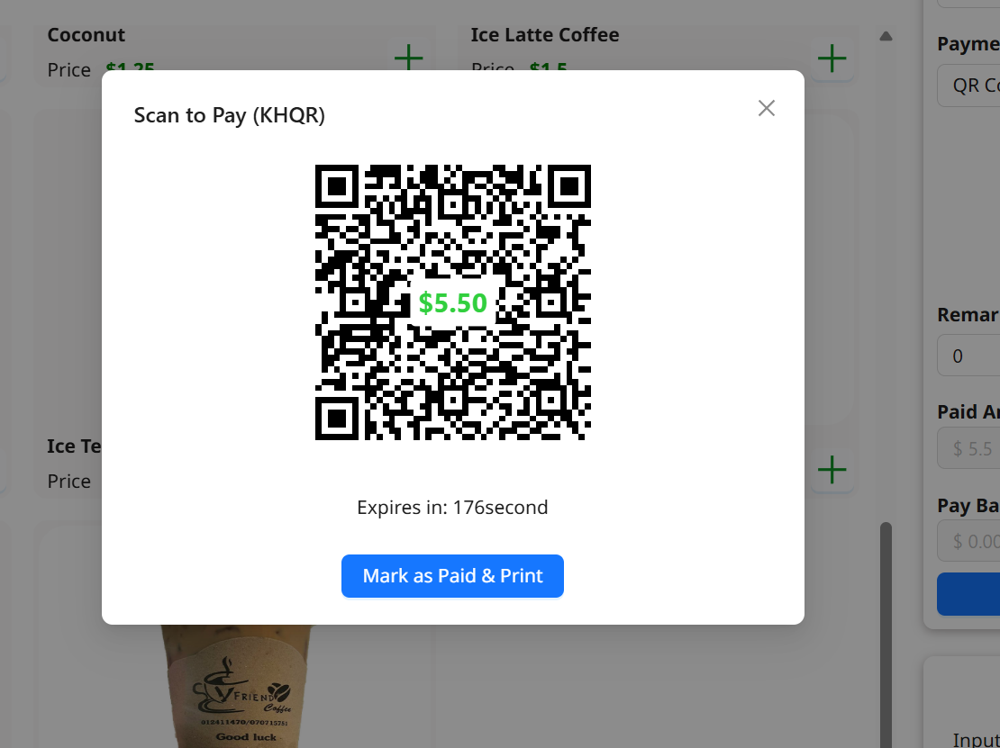
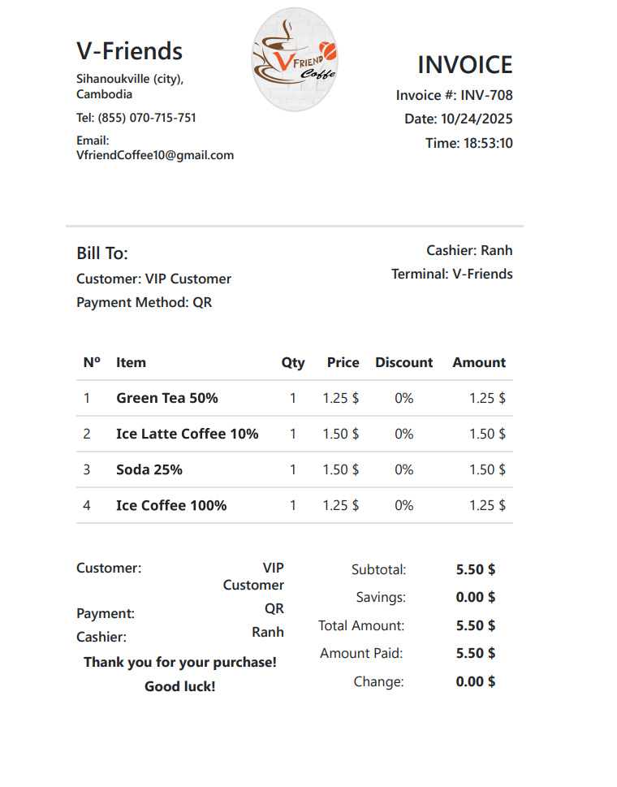

# © Coffee Management System

1. cd /backend get node package
   ```bash
   npm install 
2. then run backend:
   ```cmd
   npm start
3. cd /frontend get node package
   ```bash
   npm install 
4. then run frontend:
    ```cmd
    npm start

#Browser: http://localhost:81

#More detail please contact me : kealranhcamkh@gmail.com


#Login


#Dashboard



#POS



#Products



#Orders



#Reports



#QR Payments



#Invoices



# Requirments 
node.js veresions 16+ or release version  
   1. Server : Node + Express + DB(Relational) + JWT
   2. Client : React + Antd + Bootstrap
   ## more detail :
      https://nodejs.org/en
      
# Databse 
   Relational Database Management System (RDBMS)

# Payment Gateway 
1. Cash Pay 
2. Bakong Pay : Local Bank 

# Login

   {
      "username" : "kealranh@gmail.com", <!--your email registered-->
      "password" : "123456"
   }
   

# Register API base

1. Register:
   ```bash
   {
      "role_id" :1, <!--admin-->
      "name" : "Ranh", <!--your name-->
      "username" : "kealranh@gmail.com", <!--your email -->
      "password" : "123456"
   }
2. Login:
    ```cmd
      "username" : "kealranh@gmail.com", <!-- your email registered -->
      "password" : "123456"